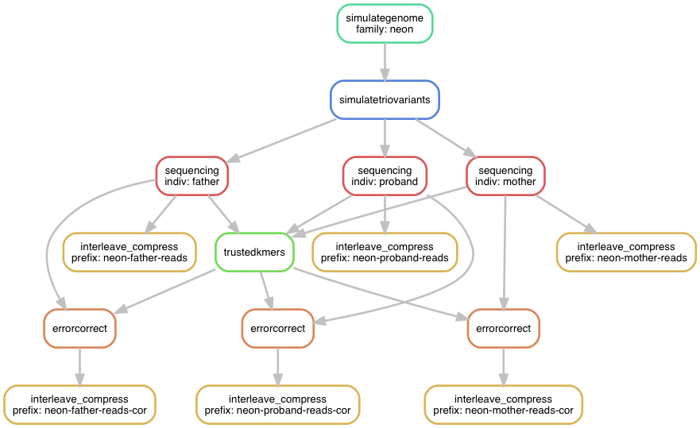

# Noble: build instructions

## Overview

**Noble** includes four simulated pedigrees, associated with genomes ranging in size from 2.5 Mbp to 2.5 Gbp.
Each pedigree includes 3 individuals: a mother, a father, and a proband.
Each pedigree also includes variants shared between some or all individuals (representing inherited mutation) as well as variants unique to the proband (representing *de novo* germline mutation).


|  Trio name  |  Genome size (Mbp)  |  # Shared variants  |  # Unique (*de novo* in proband) variants  |
|-------------|--------------------:|--------------------:|-------------------------------------------:|
|  helium     |           2.5       |               100   |                                       5    |
|  neon       |          25.0       |               200   |                                      10    |
|  argon      |         250.0       |               300   |                                      20    |
|  krypton    |        2500.0       |               750   |                                      60    |


## Workflow and implementation

The procedure used to create the Noble trios is implemented as a [Snakemake](http://snakemake.readthedocs.io) workflow.
The figure below summarizes the workflow invoked for each trio.
The only input data required is the [human.order6.mm](human.order6.mm) file, which contains initial states and transition states of a 6th-order Markov model of nucleotide composition; this is used for simulating the genome sequences.
All software prerequisites are listed below, and the project's [Dockerfile](../Dockerfile) provides details on which software versions were used and how they were installed.



- `simulategenome`: The [nuclmm](https://github.com/standage/nuclmm) package is used to simulate a haploid "reference" genome sequence.
- `simulatetriovariants`: The [kevlar](https://github.com/dib-lab/kevlar) library is used to simulate shared and unique variants with respect to the reference for a hypothetical trio and to produce a diploid genome sequence for each individual.
- `sequencing`: The [wgsim](https://github.com/lh3/wgsim) tool is used to simulate Illumina whole genome shotgun sequencing of each individual's genome with an effective error rate of approximately 1%.
- `trustedkmers`: As a preliminary error correction step, *k*-mers from all 3 samples are analyzed using [Lighter](https://github.com/mourisl/Lighter) to determine "trusted" *k*-mers in the data set.
- `errorcorrect`: Using the "trusted" *k*-mers, Lighter is again used to correct sequencing errors in the read data sample-by-sample.
- `interleave_compress`: Finally, standard shell tools are used to interleave and compress the paired read files.

## Executing the workflow

```bash
# Do a "dry-run": show the commands that will be executed to create the "helium" trio
snakemake --configfile noble.json -np helium

# Actually execute the commands to create the "helium" trio
snakemake --configfile noble.json -p helium

# Create the "neon" trio, allowing up to 4 commands to run simultaneously,
#   and skip the error correction steps.
snakemake --configfile noble.json --jobs 4 -p neon-{mother,father,proband}-reads.fq.gz

# Create all trios
snakemake --configfile noble.json --jobs 4 -p all
```

Generating the helium and neon trios requires only a few minutes of runtime.
The argon and krypton trios requires a few hours.
